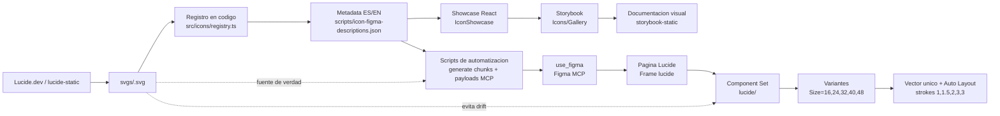

# Proyecto iconos

Sistema de iconos basado en [Lucide](https://lucide.dev/) para mantener sincronizados tres destinos:

- el repositorio, con SVGs y metadata bilingue como fuente de verdad;
- Storybook, como documentacion visual y de QA para producto/desarrollo;
- Figma, como libreria de componentes reutilizables generada automaticamente via MCP.

La idea del flujo es la del esquema adjunto: el agente trabaja desde codigo, usa las skills del proyecto para preparar los iconos, genera payloads para `use_figma` y termina publicando los mismos activos en Figma y en Storybook.

## Esquema del Flujo



## Stack

- React 19 + TypeScript + Vite.
- `lucide-react` para renderizar iconos en la app y Storybook.
- `lucide-static` como fuente local de SVGs Lucide.
- Storybook 10 para documentacion, revision visual y accesibilidad.
- Figma MCP (`use_figma`) para crear/actualizar Component Sets en Figma desde codigo.

## Estructura

```txt
svgs/                                  SVGs Lucide normalizados; fuente de verdad visual.
src/icons/LucideIcon.tsx               Wrapper comun para renderizar iconos Lucide.
src/icons/registry.ts                  Registro de iconos, componentes, descripciones y keywords.
src/showcase/IconShowcase.tsx          Showcase interactivo usado por la app y Storybook.
src/stories/IconGallery.stories.tsx    Historia principal de la galeria de iconos.
scripts/icon-figma-descriptions.json   Metadata ES/EN para busqueda en Figma.
scripts/generate-figma-buildings-chunks.mjs
                                       Genera chunks JS ejecutables por use_figma.
scripts/build-mcp-final-payloads.mjs   Envuelve chunks base64 como payloads MCP.
```

## Comandos

```bash
npm install
npm run dev
npm run storybook
npm run build-storybook
npm run build
npm run lint
```

`npm run dev` abre el showcase Vite. `npm run storybook` abre la documentacion interactiva en Storybook. `npm run build-storybook` genera la version estatica en `storybook-static/`.

## Fuente de Verdad

El repositorio manda sobre Figma. Cada icono debe existir en tres sitios coordinados:

- `svgs/<icon-name>.svg`: SVG Lucide normalizado.
- `src/icons/registry.ts`: componente React, nombre kebab-case, descripcion ES/EN y keywords.
- `scripts/icon-figma-descriptions.json`: copia bilingue usada para descripciones y busqueda en Figma.

Si un Component Set `lucide/<icon-name>` existe en Figma pero no existe su SVG equivalente en `svgs/`, se considera drift y debe eliminarse o regenerarse desde codigo.

## Variantes de Tamano y Stroke

Cada icono se publica en Figma como un Component Set llamado `lucide/<icon-name>`, con variantes `Size=<n>`.

| Tamano | Stroke actual |
| --- | --- |
| 16 px | 1 |
| 24 px | 1.5 |
| 32 px | 2 |
| 40 px | 3 |
| 48 px | 3 |

Esta tabla se usa tanto en el showcase (`IconShowcase`) como en los scripts que generan componentes en Figma. Si el sistema de diseno requiere cinco grosores unicos, el cambio debe hacerse en ambos sitios para mantener paridad entre codigo, Storybook y Figma.

## Flujo de Automatizacion

### 1. Elegir o anadir iconos Lucide

Los nombres se trabajan en formato kebab-case, igual que en `lucide.dev`: `house-wifi`, `graduation-cap`, `utility-pole`, etc.

El SVG puede venir de `lucide-static` o de `https://unpkg.com/lucide-static/icons/<icon-name>.svg`. Al incorporarlo al repo, se guarda en `svgs/<icon-name>.svg` y se normaliza para que no dependa de `currentColor` ni de atributos inconsistentes.

### 2. Registrar el icono en codigo

Cada icono visible en la galeria se importa desde `lucide-react` en `src/icons/registry.ts` y se anade al array `iconRegistry`.

La entrada incluye:

- `name`: nombre kebab-case usado en Figma, busqueda y Storybook.
- `component`: componente Lucide React.
- `descriptionEs` y `descriptionEn`: textos cortos para entender el uso del icono.
- `keywordsEs` y `keywordsEn`: terminos de busqueda para producto, diseno y QA.

### 3. Documentar metadata para Figma

`scripts/icon-figma-descriptions.json` contiene la copia que se escribe en Figma. Cada clave debe coincidir con el basename del SVG:

```json
"house-wifi": {
  "es": "Casa con wifi; hogar conectado, red domestica o internet en casa.",
  "en": "House with wifi; connected home, home network or home internet.",
  "keywordsEs": "casa, wifi, hogar conectado, red, internet, domotica, lucide, lucide.dev",
  "keywordsEn": "house, wifi, connected home, network, internet, smart, lucide, lucide.dev"
}
```

Esta metadata mejora la busqueda en el panel de Assets de Figma y evita que los componentes queden como simples vectores sin contexto.

### 4. Verificar en Storybook

Storybook usa el mismo `IconShowcase` que la app. La historia `Icons/Gallery` permite revisar:

- render del icono;
- busqueda por nombre, descripcion y keywords;
- tamano;
- stroke automatico o manual;
- color;
- tema claro/oscuro.

Antes de publicar a Figma, ejecuta:

```bash
npm run storybook
npm run build-storybook
```

### 5. Generar payloads para Figma

Los scripts preparan codigo JavaScript que luego ejecuta Figma MCP mediante `use_figma`.

```bash
node scripts/generate-figma-buildings-chunks.mjs
for f in .figma-chunk-*.js; do base64 -i "$f" > "${f%.js}.b64"; done
node scripts/build-mcp-final-payloads.mjs
```

El primer script agrupa iconos en chunks para no superar limites de tamano del payload. Despues, cada chunk se codifica en base64 para que pueda viajar dentro del JSON de MCP sin problemas de escape. El segundo script envuelve esos chunks como JSON listo para MCP. Antes de ejecutarlo, revisa el `fileKey` configurado en `scripts/build-mcp-final-payloads.mjs`.

- `.figma-chunk-<n>.js`
- `.figma-chunk-<n>.b64`
- `.mcp-final-<n>.json`

El codigo generado crea o actualiza la pagina `Lucide`, busca un frame contenedor `lucide` y publica cada icono como `lucide/<icon-name>`.

Nota: `generate-figma-buildings-chunks.mjs` esta preparado para la categoria actual de edificios/espacios. Para otra coleccion, actualiza la lista de nombres o extrae una version generica que lea desde `svgs/`.

### 6. Publicar en Figma

La publicacion via `use_figma` hace un upsert por icono:

- crea variantes `Size=16`, `Size=24`, `Size=32`, `Size=40`, `Size=48`;
- importa el SVG con `figma.createNodeFromSvg`;
- desagrupa wrappers;
- aplana siempre a una unica capa `Vector`;
- escala y centra dentro del area segura;
- aplica el stroke al final;
- activa Auto Layout para centrar cada variante;
- combina las variantes en un Component Set;
- reordena las variantes de menor a mayor tamano;
- escribe descripciones bilingues en el set y en cada variante.

El resultado esperado en Figma es una libreria limpia, sin posicionamiento absoluto manual y con componentes buscables desde Assets.

## Reglas de Calidad en Figma

- Cada Component Set se llama `lucide/<icon-name>`.
- Cada variante se llama `Size=<n>`.
- El orden visual es siempre `16 -> 24 -> 32 -> 40 -> 48`.
- Cada variante contiene exactamente una capa `Vector`.
- El stroke se aplica despues de escalar y centrar.
- Las constraints del vector son `SCALE / SCALE`.
- El Component Set usa Auto Layout horizontal.
- La metadata ES/EN debe existir antes de publicar.

## Proceso Recomendado para Anadir un Icono

1. Copiar o generar `svgs/<icon-name>.svg`.
2. Importar el componente desde `lucide-react` en `src/icons/registry.ts`.
3. Anadir la entrada completa a `iconRegistry`.
4. Anadir la entrada ES/EN en `scripts/icon-figma-descriptions.json`.
5. Revisar localmente con `npm run dev`.
6. Revisar documentacion con `npm run storybook`.
7. Construir Storybook con `npm run build-storybook`.
8. Generar payloads Figma.
9. Ejecutar `use_figma` sobre el `fileKey` de destino.
10. Revisar en Figma que el set, variantes, strokes y descripciones queden correctos.

## Resultado

Con este flujo, Lucide se convierte en una biblioteca de iconos gobernada desde codigo: los mismos nombres, SVGs, descripciones, tamanos y strokes alimentan la app, Storybook y Figma. Esto reduce trabajo manual, evita drift entre diseno y desarrollo, y permite que cada nuevo icono siga un proceso repetible.
